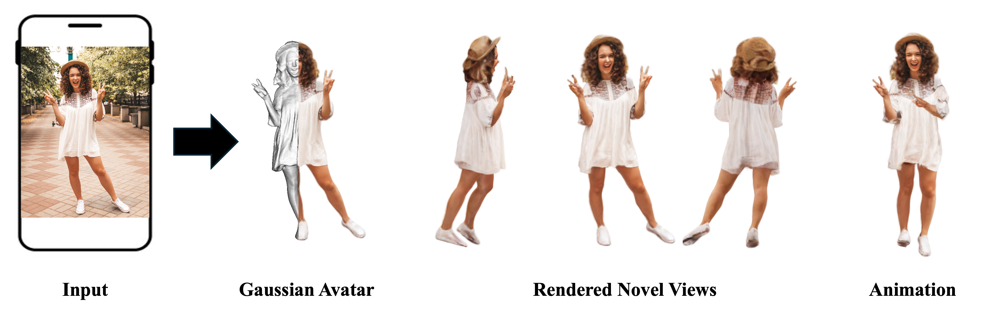

# MoGA: 3D Generative Avatar Prior for Monocular Gaussian Avatar Reconstruction

 

Official code will be released soon.

# News:

- [2025/07/24] MoGA is accepted to ICCV 2025 as a Highlight paper!


# Citation

If you find our code or paper useful, please cite as
```
@inproceedings{dong2025moga,
      title={{MoGA}: 3D {G}enerative {A}vatar {P}rior for {M}onocular {G}aussian {A}vatar {R}econstruction,
      author={Dong, Zijian and Duan, Longteng and Song, Jie and  Black, Michael J  and Geiger, Andreas},    
      booktitle   = {International Conference on Computer Vision (ICCV)},
      year      = {2025}
      }
```


